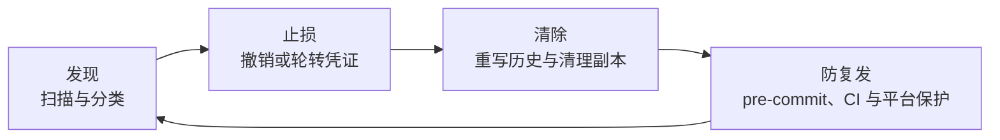

AI 时代最容易被低估的一件事，是便利和风险往往同时增长。

过去写一个部署脚本，我可能只复制几行配置；现在让 AI 分析日志、生成命令、处理技术文档、梳理项目资料或修改流水线，一次会话就可能接触大量上下文。操作速度更快了，文件流转更多了，临时数据也更容易留下。只要其中混入 token、Authorization header、私钥、连接串或包含敏感响应的调试文件，它们就可能在不经意间进入 Git。

更麻烦的是：后来从当前版本删除这个文件，并不代表信息真的消失了。

Git 保存的是历史。只要旧 commit 仍然可达，敏感内容就仍可能被找回。即使分支上已经看不到它，reflog、不可达 object、远端 Pull Request、fork、其他人的 clone 和备份也可能继续保留副本。

这篇文章来自一次真实的 Git 仓库清理。我不会展示任何真实 secret、内部路径或仓库信息，但会保留当时最有价值的判断过程、验证方法和踩坑经验。

## 一次让我重新审视 AI 结论的复核

当时我想确认一个长期维护、存放技术文档和项目资料的 Git 仓库，历史上是否提交过敏感信息，于是安装 Gitleaks，扫描当前 clone 中的全部 Git refs。

最初，AI Agent 给出的执行结论是：

```text
0 findings
```

但我随后在终端里亲自复跑同一类检查，实际结果是：

```text
216 commits scanned
21 findings
```

进一步分析后确认，这 21 条命中集中在早期历史中，涉及多个已经从当前版本删除或脱敏的文件。也就是说，工作区看起来已经干净，但旧内容仍然存在于 Git objects 中。

这不是一个可以轻轻带过的工具差异。它让我再次确认：

> AI 可以帮助我们更快地执行安全工作，但不能替我们完成证据复核。安全结论必须能够通过独立命令重复得到。

从那以后，我会把安全操作拆成四个阶段：



这四步的顺序很重要。尤其是第二步：如果命中的是仍然有效的凭证，第一动作不是重写 Git 历史，而是让凭证立即失效。

## 第一部分：先分清自己在扫描什么

Gitleaks 当前主要提供三种扫描模式：`git`、`dir` 和 `stdin`。在仓库治理中，我最常用的是前两种，再加上 `git` 模式的 `--staged` 参数。本文命令已在 Gitleaks 8.30.1 中核验。

还要先划清能力边界：Gitleaks 主要检测 password、API key、token 等 secret，不是通用的数据防泄漏工具。客户数据、个人信息、内部域名和业务敏感字段仍需依靠数据分类规则、定制扫描和人工审查。

### 扫描全部 Git 历史

```bash
gitleaks git --log-opts="--all" --redact=100 --no-banner .
```

这条命令解决的是：“当前 clone 中所有 branches、tags 和其他 refs 可达的历史里，是否出现过疑似 secret？”

- `git`：分析 Git patch，底层围绕 `git log -p` 工作。
- `--log-opts="--all"`：把 `--all` 传给 Git，避免只看当前分支。
- `--redact=100`：在终端和日志中完全隐藏匹配到的 secret 值。
- `--no-banner`：隐藏启动横幅，让自动化输出更简洁。

这里的“全部”有明确边界：`--all` 只覆盖当前 clone 已有的 refs 和 Git objects。浅克隆、未 fetch 的远端分支、fork、Pull Request 专用 refs 和其他人的 clone 不会凭空进入扫描范围。审计远端仓库前，应先确认 clone 不是 shallow，并按托管平台的方式获取需要检查的 refs。

默认情况下，退出码 `0` 表示没有发现泄露；退出码 `1` 可能表示发现泄露或执行出错。因此，自动化不能只保存一个数字，还要保留脱敏后的日志并判断命令是否完整执行。

我把它作为仓库接管、公开发布前审计和周期性全量复核的核心命令。

### 扫描当前目录和工作区文件

```bash
gitleaks dir --redact=100 --no-banner .
```

`dir` 不关心 Git 历史，而是扫描当前目录中的文件。它可能看到：

- 未跟踪文件；
- 被 `.gitignore` 忽略的文件；
- 构建产物和导出目录；
- 调试响应文件；
- 教学示例和测试夹具。

在我的实战中，Git 历史清理完成后，`gitleaks git` 已经是 0 findings，但 `gitleaks dir` 仍然发现 10 条命中。最终核实发现，其中一部分来自 ignored 的临时导出，另一部分来自用于演示 Secret 和 Authorization 的教学示例。

这说明两个结果并不矛盾：

| 扫描方式                          | 回答的问题               | 是否扫描 Git 历史    | 是否可能扫描 ignored 文件 |
| --------------------------------- | ------------------------ | -------------------- | ------------------------- |
| `gitleaks git --log-opts="--all"` | 历史提交过什么           | 是                   | 否，除非内容进入过历史    |
| `gitleaks dir`                    | 当前目录现在有什么       | 否                   | 是                        |
| `gitleaks git --staged`           | 下一次 commit 将带入什么 | 否，只看 staged diff | 已暂存就会扫描            |

### 扫描即将提交的内容

```bash
gitleaks git --staged --redact=100 --no-banner .
```

这条命令适合 pre-commit，因为它精确对应即将进入 commit 的差异。未跟踪文件一旦执行 `git add`，也会成为 staged 内容并进入扫描。

我不建议把 `gitleaks dir` 直接塞进每次 commit：它会反复扫描 ignored 文件、依赖目录和构建产物，既增加耗时，也会把与本次提交无关的命中带进来。日常提交检查用 `--staged`，目录审计作为独立任务运行，两者职责更清楚。

## 第二部分：不要看到 finding 就立刻加 allowlist

安全扫描不是简单地追求“数字归零”。真正的工作是分类。

我通常先回答五个问题：

1. 命中的值是否真的具备认证、授权或数据访问能力？
2. 它现在是否仍然有效？
3. 它是否进入过 Git 历史，还是只存在于 ignored 文件？
4. 它是唯一事件，还是同一内容在多个生成文件中的复制？
5. 它是否存在于其他 clone、fork、备份、制品或平台缓存中？

常见命中可以分成四类：

| 类型                     | 典型例子                                 | 推荐动作                                   |
| ------------------------ | ---------------------------------------- | ------------------------------------------ |
| 真实且有效的凭证         | token、password、private key             | 立即撤销或轮转，再清理历史和副本           |
| 已失效但进入过历史的凭证 | 旧 token、旧连接串                       | 评估暴露面，按合规要求决定是否重写历史     |
| 公开标识符或高熵业务值   | analytics measurement ID、公开 client ID | 核实文档和权限语义后，做最小范围 allowlist |
| 教学、测试或生成内容     | Secret 示例、fixture、重复导出           | 保留时做精确豁免；低价值产物优先删除       |

这里有一个我很坚持的原则：

> 不要为了让扫描变绿，就对整个 `.tmp`、`examples` 或测试目录做宽泛 allowlist。

宽泛豁免会让今天的误报消失，也可能让明天真正落入同一目录的凭证一起消失。更好的办法是删除低价值临时产物，或者按具体 fingerprint、规则、路径和上下文建立可审计的最小豁免。

## 第三部分：从当前版本删除文件，为什么还不够

假设某个文件在第 10 次 commit 中加入了 token，在第 20 次 commit 中被删除。当前 `HEAD` 已经找不到它，但下面的命令仍可能看到历史：

```bash
git log --all -- path/to/removed-file
```

Git 的内容寻址模型意味着，只要相关 commit 或 object 仍被引用，旧内容就仍然存在。历史清理的目标不是再提交一次删除，而是重写包含敏感内容的历史，使新的 commit graph 从未包含那些内容。

但重写历史有明显副作用：

- 引入敏感内容的 commit 以及其后的 commit SHA 都会变化；
- commit 和 tag 签名可能失效或被移除；
- 旧 Pull Request 的 diff 和评论关联可能受影响；
- 分支保护可能暂时阻止 force push；
- 旧 clone 可能把污染历史重新推回远端；
- forks、缓存页面、备份和其他制品不会自动消失。

因此，历史重写不是一个普通的 Git 整理动作，而是一次需要风险评估和协作窗口的安全变更。

## 第四部分：我如何安全地重写仓库历史

我的核心原则是：**不要一上来就在唯一工作副本中执行强制重写。**

### 第一步：先让凭证失效

如果 finding 对应真实凭证：

1. 撤销或轮转 secret；
2. 检查相关访问日志；
3. 更新 Secret Manager、CI/CD 和运行环境；
4. 验证旧凭证无法继续使用；
5. 再决定是否重写历史。

历史清理减少的是残留和二次传播风险，凭证轮转消除的是当前可利用性。两者不能互相替代。

### 第二步：记录基线并创建仓库外备份

先确保工作区干净：

```bash
git status --short
```

再记录当前版本的 Tree SHA：

```bash
git rev-parse 'HEAD^{tree}'
```

Tree SHA 表示当前文件树的内容、路径和文件模式。历史重写后，如果目标 HEAD 的 Tree SHA 与原值一致，只能证明这个 HEAD 对应的文件树没有被意外改写；其他 branches、tags、refs 和 commit 元数据仍需单独核对。

重写前可以创建 bundle：

```bash
git bundle create ../repository-before-rewrite.bundle --all
git bundle verify ../repository-before-rewrite.bundle
```

但必须明确：这个 bundle 包含待清理的旧历史，本身就是敏感备份。它应放在仓库外的受控位置，限制访问，并在稳定期结束后安全删除。不要把 bundle 同步到普通网盘，更不要再次提交进 Git。

### 第三步：只在 fresh clone 中操作

`git-filter-repo` 的设计本身就鼓励 fresh clone 工作流。执行失败时，直接丢弃临时 clone，比在原仓库里尝试恢复更可靠。

```bash
git clone --no-local /path/to/source-repository repository-rewrite
cd repository-rewrite
```

如果是远端团队仓库，应按照平台官方的敏感数据清理流程克隆并覆盖所有需要处理的 refs，而不是只重写当前分支。

### 第四步：删除敏感文件的全部历史

使用支持 `--sensitive-data-removal` 的 `git-filter-repo`，版本至少为 2.47：

```bash
git filter-repo \
  --sensitive-data-removal \
  --invert-paths \
  --path path/to/retired-export.json \
  --path path/to/old-debug-response.txt
```

如果文件曾经移动或改名，必须把所有历史路径都列出来，否则旧路径中的内容仍可能保留。

### 第五步：对必须保留的文件替换敏感文本

如果文件有长期价值，只需要替换其中的历史 secret，可以使用：

```bash
git filter-repo \
  --sensitive-data-removal \
  --replace-text ../replacements.txt
```

`replacements.txt` 可能包含旧 secret，因此它也必须作为临时敏感文件处理。不要把它放进仓库，不要在聊天、终端 transcript 或构建日志中打印内容，完成后要安全删除。

### 第六步：验证，而不是凭感觉宣布完成

我至少会执行以下验证：

```bash
gitleaks git --log-opts="--all" --redact=100 --no-banner .
git log --all -- path/to/retired-export.json
git fsck --full
git status --short
git rev-parse 'HEAD^{tree}'
```

验收标准包括：

- Gitleaks 全历史为 0 findings；确属误报的内容只使用经过审计的精确豁免，并单独保留判定证据；
- 被清理路径在所有可达 refs 中没有历史；
- `git fsck` 没有对象完整性错误；
- 工作区干净；
- 重写后的目标 HEAD Tree SHA 与重写前一致；
- 预期之外的 branches、tags 和文件没有消失。

我的那次实战最终满足了这些条件：21 条历史命中归零，退役敏感路径不再出现在可达 commit 中，当前文件树没有变化，对象完整性检查通过。

这里也要避免过度解读：`git fsck --full` 验证的是对象库完整性，不等于证明旧敏感对象已经物理消失。不可达对象、reflog 和外部副本仍需单独处理。

### 第七步：处理旧对象和外部副本

即使新历史已经正确，旧 object 仍可能暂时存在于原工作副本的 reflog 或对象库中。确认恢复 bundle 可用、新历史稳定且不再需要回退后，才进入 reflog 过期和垃圾回收阶段。

还要继续检查：

- 旧 clone 和 fork；
- CI workspace、artifact 和缓存；
- 企业云盘、备份软件或文件版本历史；
- 聊天附件和工单附件；
- Pull Request refs 和平台缓存；
- LFS objects。

`git gc` 只负责当前对象库，不会替你清理这些外部副本。

## 第五部分：团队仓库，技术命令只占一半

个人维护的仓库可以在自己控制的时间窗口内完成重写。团队共享仓库则必须把它当成一次变更管理。

我建议按下面的顺序执行：

1. **立即轮转**：先撤销或轮转暴露的凭证，检查访问日志。
2. **确认范围**：定位首次引入位置、受影响 refs、Pull Requests、forks、LFS 和外部副本。
3. **宣布冻结**：暂停 merge、push、release 和自动写回仓库的 Bot。
4. **关闭或合并开放 PR**：减少 SHA 变化导致的 diff 与评论失效。
5. **fresh clone 重写**：由单一负责人执行并保留可审计命令记录。
6. **独立复核**：由第二人复跑 Gitleaks、路径检查和 refs 对比。
7. **受控 force push**：临时调整必要的分支保护，覆盖受影响 refs 后立即恢复保护。
8. **平台侧清理**：需要时联系托管平台清理 Pull Request refs、缓存视图、服务器对象和 LFS 残留。
9. **协作者重新同步**：优先删除旧 clone 后重新 clone；确需保留的本地分支必须基于新历史 rebase，不能把旧历史 merge 回来。
10. **观察再开放**：确认没有旧 SHA 或 finding 被重新引入后解除冻结。

最危险的场景，是某位协作者保留旧 clone，在重写后执行一次普通 merge 和 push。这样可能把刚清理掉的历史完整带回来。所以团队沟通不是附加项，而是清理方案本身的一部分。

## 第六部分：把一次清理变成长期能力

只做一次全历史扫描，很容易在几周后回到原点。我最后把防线分成三层。

### 第一层：pre-commit 检查 staged 内容

仓库可以维护一个可审查的 hook，例如：

```sh
#!/usr/bin/env sh
set -eu

if ! command -v gitleaks >/dev/null 2>&1; then
  echo "gitleaks is required before committing" >&2
  exit 1
fi

gitleaks git --staged --redact=100 --no-banner .
```

团队成员在本地启用仓库 hook 路径：

```bash
git config core.hooksPath .githooks
```

需要注意，`core.hooksPath` 属于本地 Git 配置，不会随着 clone 自动生效。仓库可以提交 hook 脚本，但必须通过 setup 脚本、开发文档或 bootstrap 流程帮助每位协作者启用。

### 第二层：CI 扫描

pre-commit hook 可以被跳过，也可能没有安装。因此 CI 应再次扫描 Pull Request 或 push 带来的变化。对于周期性审计和公开发布前检查，还应获取需审计 refs 的完整历史并运行全 refs 扫描。

pre-commit 负责尽早反馈，CI 负责统一执行。两者不是重复建设，而是不同信任边界。

### 第三层：平台 Secret Scanning 和 Push Protection

如果代码托管平台支持 Secret Scanning、Push Protection 或组织级规则，应继续启用。平台可以在 push 边界阻断已知凭证类型，也更容易形成统一告警、审计和响应流程。

完整防线应该是：

```text
Secret Manager
-> 开发者 staged 扫描
-> CI 安全检查
-> 托管平台 Push Protection
-> 周期性全历史审计
-> 泄露后的轮转与响应流程
```

任何单点都会漏，分层才是工程化安全。

## 第七部分：AI Agent 参与安全操作时，我保留四个人工门禁

AI Agent 非常适合承担重复劳动：安装工具、生成候选命令、定位命中来源、比较 refs、整理验证结果、生成 hook 和记录操作证据。但涉及敏感信息和破坏性历史操作时，我不会把全部判断交给 Agent。

我会保留四个明确门禁：

1. **扫描结果复跑**：关键命令由人或独立自动化再次执行，核对退出码和统计结果。
2. **finding 人工定性**：Agent 可以聚类，凭证有效性、业务语义和 allowlist 必须由责任人确认。
3. **历史重写前批准**：确认工作区、备份、影响 refs、协作者和回滚边界。
4. **重写后独立验收**：复扫、Tree SHA、路径可达性、`git fsck` 和远端状态都要有证据。

这不是不信任 AI，而是正确划分责任：AI 提升速度，人对不可逆决策和最终安全结论负责。

## 第八部分：把方法落到行动清单

### 给个人开发者的最小方案

如果你维护的是个人仓库，可以从这套最小闭环开始：

1. 安装 Gitleaks。
2. 运行 `gitleaks dir` 检查工作区文件。
3. 确认当前 clone 的 refs 和对象范围后，运行 `gitleaks git --log-opts="--all"` 检查全部可达历史。
4. 对真实凭证先撤销或轮转。
5. 需要重写时，创建仓库外 bundle，并只在 fresh clone 使用 `git-filter-repo`。
6. 用 Gitleaks、Tree SHA、路径查询和 `git fsck` 验证。
7. 清理旧 clone、临时规则文件和敏感备份。
8. 增加 staged pre-commit，并在托管平台启用可用的保护能力。

### 给团队的验收清单

- [ ] 暴露凭证已经撤销或轮转，旧值无法继续使用。
- [ ] 已确认受影响 branches、tags、Pull Requests、forks、LFS 和外部副本。
- [ ] 清理窗口内已冻结仓库写入和自动化写回。
- [ ] 重写操作在 fresh clone 中执行，并保留脱敏审计记录。
- [ ] 第二位复核者独立确认扫描结果和 refs 变化。
- [ ] 因历史重写而临时调整的分支保护规则，已在 force push 完成后恢复。
- [ ] 平台缓存、Pull Request refs 和服务器对象已按需处理。
- [ ] 协作者已重新 clone 或按规范 rebase，未 merge 旧历史。
- [ ] pre-commit、CI 扫描和平台保护均已启用。
- [ ] 完成观察期后，敏感恢复备份已安全销毁。

## 最后：安全不是 AI 效率的对立面

很多人谈 AI 编程时，只谈生成速度、上下文能力和 Agent 自动化。我更关心另一个问题：当操作规模被放大以后，我们有没有同步放大验证、审计和恢复能力？

这次实战里，真正有价值的并不是把 21 变成 0，而是建立了一条可以重复的证据链：

```text
发现历史命中
-> 验证与分类
-> 轮转和止损
-> 在隔离副本重写
-> 验证当前内容未变化
-> 清理旧对象和外部副本
-> 增加 pre-commit、CI 与平台防线
```

AI 让我们做得更快，安全工程让我们知道自己做对了什么、还遗漏了什么，以及出了问题能否恢复。

对个人开发者，这是保护账号、项目和数字资产的基本功；对团队，它是代码治理、供应链安全和协作纪律的一部分。便利和安全并不是二选一。真正成熟的 AI 工作流，应该同时拥有两者。

## 参考资料

- [Gitleaks 官方仓库与使用说明](https://github.com/gitleaks/gitleaks)
- [git-filter-repo 官方仓库](https://github.com/newren/git-filter-repo)
- [GitHub Docs：Removing sensitive data from a repository](https://docs.github.com/en/authentication/keeping-your-account-and-data-secure/removing-sensitive-data-from-a-repository)
