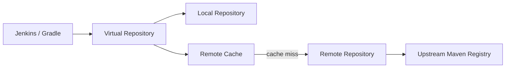
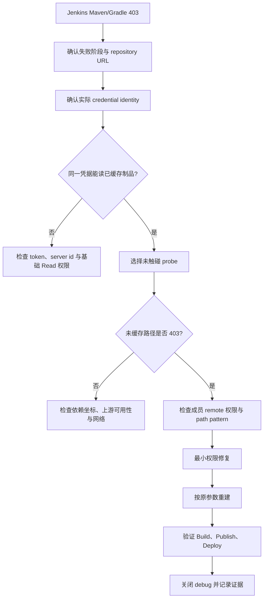

一次 Jenkins 构建失败，日志看起来非常普通：Gradle 无法解析依赖，Artifactory 返回 403。

更奇怪的是，换一个依赖坐标，有时又能下载。手工请求一次失败的 POM 后重新构建，原来的错误消失了，但流水线会在下一个依赖处再次收到 403。

最直觉的判断通常是：Jenkins token 过期了，或者 Jenkins 使用的 token 与本地不同。

本案例最终确认，在当时的目标环境中，这个直觉是错的。真正的问题发生在 virtual repository 的冷缓存路径：账号有权读取已经进入缓存的制品，却没有完成 remote repository 首次拉取和缓存所需的权限。

这篇文章不展示任何内部域名、仓库名、Job、构建号、IP、账号或 token 标识，只保留可以迁移到其他 Artifactory 和 Jenkins 环境的方法。

## 现象为什么容易误导

流水线最初在一个 Spring 依赖处失败：

```text
Could not resolve com.example:library-a:1.2.3
Could not GET .../example-maven-virtual/com/example/library-a/1.2.3/library-a-1.2.3.pom
Received status code 403 from server
```

手工请求这个文件后再次构建，失败点变成另一个 SDK。重复几次后，构建似乎可以“向前推进”。

这组现象很容易导向三个错误结论：

1. token 权限不稳定；
2. 上游仓库随机返回 403；
3. 只要持续重试，缓存逐渐补齐，问题就会自然消失。

第三种做法尤其危险。它会把一次可诊断的授权故障，变成一串不断变化的依赖失败，而且每次手工 `GET` 都可能改变 Artifactory 的缓存状态。

## Virtual repository 不只是一层 URL

一个 Maven virtual repository 通常聚合多个 local 和 remote repositories：



从客户端看，请求始终访问同一个 virtual URL。但服务器内部至少存在两条不同路径。

### 缓存命中

制品已经存在于 remote cache。Artifactory 只需要从自己的缓存向客户端返回内容。

### 冷缓存

制品尚未缓存。Artifactory 需要访问上游 registry、取得内容、写入 remote cache，再通过 virtual repository 返回给客户端。

如果账号只有读取现有缓存的能力，却没有当前平台策略要求的 cache population 权限，就可能出现非常有欺骗性的结果：

| 请求                     | 结果 |
| ------------------------ | ---- |
| virtual + 已缓存制品     | 200  |
| virtual + 未缓存制品     | 403  |
| 再次请求被手工预热的制品 | 200  |
| 下一个未缓存制品         | 403  |

因此，“这个账号能下载某个文件”并不能证明整条 remote resolution 链路拥有正确权限。

## 第一步：先固定 credential，而不是先换 token

403 既可能来自身份问题，也可能来自授权问题。第一步应该固定变量，而不是立即更换 token。

排查时应确认以下事实：

- Jenkins Job 实际绑定的 credential ID；
- credential 的用户名；
- Jenkins 和本地探针是否使用同一 token identity；
- Gradle settings 中的 server/repository id 是否映射到该 credential；
- 403 来自 virtual repository、具体 remote repository，还是上游 registry。

比较 token 时不需要输出 token 本身。可以在受控进程内比较安全的稳定标识或摘要，并在结束后清理变量。JWT claim 只能作为辅助证据：不同解码器可能对数组、默认 claim 或 scope 的展示不同，不能只因一边显示 `(none)` 就断言两个 token 权限不同。

只有确认 Jenkins 与本地使用的是同一身份，后续 HTTP 行为对照才有意义。

## 第二步：建立四格证据矩阵

排查 virtual repository 时，不要只测试一个 URL。至少区分两个维度：

- 入口：virtual repository 与其成员 remote repository；
- 状态：已缓存制品与从未请求过的 probe 制品。

形成下面的矩阵：

| 路径    | 已缓存制品 | 未触碰 probe | 解释                                |
| ------- | ---------- | ------------ | ----------------------------------- |
| Virtual | 200        | 403          | virtual 本身可用，冷缓存链路受限    |
| Remote  | 200 或可读 | 403          | 优先检查 remote 权限与 path pattern |

这里的关键是“未触碰”。如果 probe 已经被任何人请求过，它就不能继续证明冷缓存行为。

如果目标环境提供可审计的 storage/cache metadata API 或 UI，可以先用它辅助确认目标是否已缓存，再使用 `HEAD` 检查响应。这些信号都不是判断冷缓存状态的唯一标准，必须结合请求前后的缓存状态和服务器日志交叉验证。

下面的命令只适用于临时、受控的诊断环境。不要在共享终端开启命令回显，也不要把 token 写入命令参数、脚本或 CI 日志：

```bash
(
  set +x
  export JFROG_CLI_HOME_DIR="$(mktemp -d)"
  trap 'unset ARTIFACTORY_ACCESS_TOKEN; rm -rf "$JFROG_CLI_HOME_DIR"' EXIT

  read -r -s -p 'Artifactory access token: ' ARTIFACTORY_ACCESS_TOKEN
  printf '\n'
  printf '%s' "$ARTIFACTORY_ACCESS_TOKEN" |
    jf config add runtime-probe \
      --url="https://artifactory.example.com" \
      --access-token-stdin \
      --interactive=false

  jf rt curl \
    -XHEAD \
    /example-maven-virtual/com/example/cold-cache-probe/1.0/probe-1.0.pom \
    --server-id=runtime-probe
)
```

`HEAD` 按 HTTP 语义属于安全方法，但代理仓库仍可能刷新 metadata 或改变内部状态，因此它只能作为临时探针，不能被视为无副作用操作或长期生产检查。最稳妥的做法是使用专门的 disposable probe coordinate，并在测试前后检查缓存 metadata。不要拿流水线当前失败的真实依赖做实验。

## 第三步：为什么手工 GET 会污染实验

本次排查中出现过一个关键反模式：直接 `GET` 失败依赖。

当请求经过 remote repository 时，Artifactory 可能从上游拉取制品并写入缓存。即使客户端最初看到的行为不符合预期，缓存状态也可能已经变化。下一次流水线于是跳过当前依赖，在下一个未缓存依赖处失败。

这会制造一种错觉：

> 每做一次排查操作，系统似乎就“好一点”。

实际上，我们只是逐个预热依赖，没有修复任何授权策略。项目升级、缓存清理或新增依赖后，故障还会回来。

因此，cold-cache 排错应增加三条硬约束：

1. 不 `GET` 当前失败 artifact；
2. probe 必须是可丢弃且此前未触碰的坐标；
3. 每次请求都记录测试前后的缓存状态。

## 第四步：检查权限时不要只看 Read

在这次环境中，修复点位于成员 remote repositories 的 Permission Target。目标 group 原本可以读取已有内容，但冷缓存路径缺少所需的 `Deploy/Cache` 能力。

最终核对项包括：

| 检查项           | 要回答的问题                                                       |
| ---------------- | ------------------------------------------------------------------ |
| Principal        | 权限授给了 Jenkins 实际使用的 user 或 group 吗？                   |
| Repository scope | 权限是否覆盖 virtual 的相关成员 remote repositories？              |
| Read             | 能读取已存在或已缓存内容吗？                                       |
| Deploy/Cache     | 当前 Artifactory 版本和组织策略是否要求该权限来填充 remote cache？ |
| Include pattern  | 依赖路径是否被允许，例如 `**`？                                    |
| Exclude pattern  | 是否存在覆盖目标路径的排除规则？                                   |

JFrog 当前官方权限文档说明：对于 remote repository，`Read` 只允许下载已存在于 remote cache 的制品；要缓存此前不存在于 remote cache 的上游制品，需要 `Deploy/Cache`。不过，权限界面和相关行为仍应结合目标 Artifactory 版本、repository 类型和组织策略验证，不能只按一次环境里的按钮名称机械套用。

本次修复后，账号在相关 remote repositories 上具备了读取和冷缓存所需权限，未触碰依赖开始直接通过 virtual repository 下载，不再需要手工预热。


_图：通用 Artifactory 权限界面示意，仅用于说明权限项名称，不代表任何特定生产环境配置。本案例修复涉及 `Read` 与 `Deploy/Cache`；截图中的 `Annotate` 同时处于启用状态，但与本次依赖下载及冷缓存修复无关。_

## 第五步：重建流水线必须复用原参数

权限修复后，验证过程中又出现了一个与根因无关的问题：参数化 Job 重建时漏掉了原来的 branch 参数。流水线因此没有拉到预期代码，随后报出：

```text
gradlew: No such file or directory
```

这个错误不是 Artifactory 修复失败，而是验证构建与原失败构建并不等价。

重建前应从失败构建的 `ParametersAction` 或 Jenkins API 读取全部参数：

```bash
curl --fail --silent --show-error \
  --user "$JENKINS_USER:$JENKINS_TOKEN" \
  'https://jenkins.example.com/job/team/job/service/123/api/json?tree=actions[parameters[name,value]]'
```

然后逐项复用原值。不要猜测 `master`、`main`、默认 action 或环境。只要参数不同，这次构建就不是有效的对照实验。

## 第六步：成功标准不是“依赖下载过去了”

权限变更后，最小技术验证是未缓存 probe 返回成功。但流水线验收不能停在这里。

完整验收标准是：

- Build 成功，包括完整依赖解析与测试；
- Publish 成功，制品进入目标 repository；
- Deploy 成功，目标环境所有节点完成部署；
- 临时 Gradle debug 已关闭；
- 构建达到最终 `SUCCESS`，而不是仍在队列或运行中；
- 至少覆盖原先失败的不同 Job 类型和环境。

只有这样，才能证明权限变更恢复的是交付链路，而不只是某一个 HTTP 请求。

## 一条更稳的排错顺序

这次经历最终被压缩成下面的决策顺序：



## 最后的判断

面对 Artifactory 403，我现在不会先问“token 要不要换”，而会先问四个问题：

1. Jenkins 和本地是否真的使用同一 credential？
2. 成功的制品是不是已经缓存？
3. 未触碰制品是否只在冷缓存路径失败？
4. 我的探针是否改变了缓存状态？

如果同一凭据能读取已缓存制品，却稳定拒绝未缓存制品，那么排查重点应该从“凭据是否有效”转向“virtual 背后的 remote resolution 是否被完整授权”。

403 只是表面现象。真正有价值的能力，是把认证、授权、repository routing 和缓存状态拆开验证，并确保每一次验证都没有偷偷改变下一次实验的条件。

## 参考资料

- [JFrog Platform Administration：Permissions](https://docs.jfrog.com/administration/docs/permissions)
- [JFrog Artifactory：Remote Repositories](https://docs.jfrog.com/artifactory/docs/remote-repositories)
