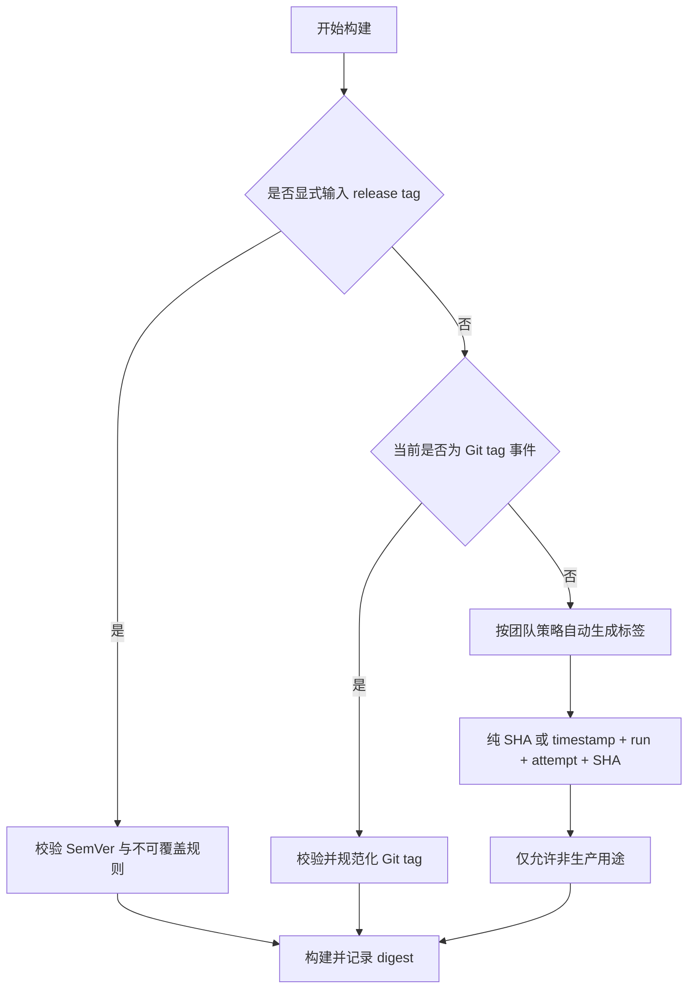

我看过不少 CI/CD 流水线，Docker image tag 的生成往往只有一两行，却决定了后续一连串问题能不能说清楚：

- 这次部署对应哪次代码变更？
- Test 验证的镜像和 Prod 运行的是不是同一份制品？
- 线上出问题时，能不能从 Pod 里的镜像反查 commit 和流水线？
- 回滚时，我们选择的是一个明确版本，还是一个可能已经被覆盖的名字？

所以在我看来，image tag 从来不是“给镜像起个名字”这么简单。它是源码、构建、制品和运行环境之间的一份身份契约。

我最初把常见做法记成了“三种情况”，但实际列出了四项：手动输入、Git tag、Git SHA 和默认值。进一步对照真实流水线后，我意识到 Git SHA 和所谓“默认值”并不应该分成两类。它们都属于没有显式发布版本时的自动生成策略，区别只是生成公式不同。

```text
手动输入：人为声明发布版本
Git tag：代码仓库声明发布版本
自动生成：纯 SHA，或 timestamp + run identity + SHA
```

这处看似很小的分类修正，恰好揭示了镜像标签治理的核心：先区分标签来源和目的，再选择具体生成公式。Git SHA 已经足以避免标签为空并建立源码追踪，多参数组合不是第二层兜底，而是同类策略中对人类更友好的一种实现。

## 先给结论：三类标签，三种职责

| 标签来源 | 主要职责                   | 推荐形式                                                     | 是否要求 SemVer | 是否适合直接发布 Prod                 |
| -------- | -------------------------- | ------------------------------------------------------------ | --------------- | ------------------------------------- |
| 手动输入 | 表达一次受控发布意图       | `1.8.0`、`1.8.1-hotfix.1`                                    | 发布版本应要求  | 有门禁时可以                          |
| Git tag  | 让代码版本自然驱动发布版本 | Git ref `v1.8.0`，镜像 tag `1.8.0`                           | 应要求          | 推荐                                  |
| 自动生成 | 无显式版本时标识并追踪构建 | `sha-a1b2c3d4e5f6` 或 `ci-20260802T0630Z-184-2-a1b2c3d4e5f6` | 不要求          | 可部署到非生产环境，不应自动进入 Prod |

这里最重要的判断是：**SemVer 表达发布语义，SHA 表达源码身份，digest 表达制品身份。三者不是替代关系。**

如果强迫 SHA 或临时构建号也长成 `1.2.3`，我们得到的不是更规范的版本，而是一批没有真实发布语义的伪版本。

## 第一类：控制台手动输入

手动输入常见于 `workflow_dispatch`、Jenkins parameterized build 或发布平台表单。例如发布人输入：

```text
1.8.0
1.8.1-hotfix.1
2.0.0-rc.3
```

它的优点很直接：意图明确，适合受控发布、hotfix、补发和灾难恢复。但它也是最容易发生人为错误的入口：

- 拼错版本号。
- 重复使用已经存在的 tag。
- 输入分支名、日期或环境名，破坏版本口径。
- 用同一个 tag 覆盖不同镜像。
- 输入了一个从未在 Test 验证过的版本。

因此，我不会因为它是“人工确认”就默认信任它。恰恰相反，手动输入必须配最严格的机器校验：

1. 校验是否符合团队约定的 SemVer 格式。
2. 校验目标 tag 是否已存在，release tag 禁止覆盖。
3. 校验这个版本是否对应已验证的 image digest。
4. 记录操作者、commit、workflow run 和审批证据。
5. Prod 只允许选择候选制品，不允许现场重新构建。

手动输入应该是“选择一个已知制品”，而不是“临时创造一个未知制品”。

## 第二类：通过 Git tag 自动生成

这是我更推荐的正式发布入口。开发或发布人员创建 Git tag：

```text
v1.8.0
v1.8.1-rc.1
v1.8.1-hotfix.1
```

流水线监听 tag push，校验版本后生成对应的镜像标签：

```text
Git tag:      v1.8.0
Image tag:    1.8.0
Source SHA:   a1b2c3d4e5f6...
Image digest: sha256:7f9c...
```

Git tag 的价值不只是减少一次手工输入，而是让 release version 与 source ref 建立显式关系。代码仓库、流水线和镜像仓库都能围绕同一个版本进行追踪。

不过，这里有两个经常被忽略的细节。

### `v1.8.0` 与 SemVer 的关系

SemVer 的核心版本是 `1.8.0`。很多团队习惯在 Git tag 前加 `v`，这是常见的仓库命名约定，但镜像标签可以在构建时规范化为 `1.8.0`。关键不是争论要不要 `v`，而是团队必须保持一种稳定、可校验的映射。

### 同一个 Git tag 重新构建，不代表同一份镜像

即使源码 ref 相同，基础镜像、外部依赖、构建参数、runner 环境和时间戳仍可能变化。重新构建可能产生不同 digest。

所以我的发布基线是：

> Git tag 决定“这个版本叫什么”，image digest 决定“这份制品究竟是谁”。

## 第三类：自动生成标签

对于每次分支提交、Pull Request 验证、持续集成和非正式环境部署，如果没有手动输入或 Git tag，流水线就需要自动生成标签。这里常见的不是两个兜底层级，而是两种可替换的实现策略。

### 策略一：只使用 Git SHA

```text
sha-a1b2c3d4e5f6
```

它最大的价值是可追踪。看到运行中 Pod 的镜像 tag，就可以反查：

```text
image tag
-> source commit
-> branch / pull request
-> CI run
-> build logs
-> deployment record
```

这也是我做线上排错时非常依赖的一条链路。一个只有 `dev`、`test` 或 `latest` 的镜像，很难快速回答“线上到底运行了哪次代码变更”；一个带 SHA 的镜像，至少给了我们明确的源码锚点。

但 SHA 也有边界：

- 对人不友好，无法直接表达业务发布版本。
- 短 SHA 需要选足够长度，避免大型仓库中的碰撞风险。
- SHA 只能证明源码身份，不能单独证明构建产物相同。
- 同一个 commit 仍可能因为构建环境变化产生不同 digest。

因此，我会把 SHA 作为每个自动生成标签都应该具备的追踪字段，但不会把它当成唯一的 release version。

### 策略二：使用多参数组合

纯 SHA 对机器足够，对人却不够友好。看到 `sha-a1b2c3d4e5f6`，我还要去代码仓库和流水线查询，才能知道它是什么时候、由哪次 run 构建的。多参数组合把这些高频排障信息直接编码进标签：

```text
ci-<timestamp>-<run_number>-<run_attempt>-<short_sha>
```

例如：

```text
ci-20260802T0630Z-184-2-a1b2c3d4e5f6
```

我更倾向这种组合。人看到标签，就能快速读出构建时间、流水线运行编号、重试次数和源码身份；机器也仍然可以按 SHA 与 run ID 精确反查。发生线上问题时，这能减少一次甚至多次跨平台查询。

不过，组合字段不是越多越好。我会优先保留四项：

- `timestamp`：快速判断构建时间与事件时间线是否吻合，必须约定 UTC 或明确时区。
- `run_number`：定位具体流水线执行。
- `run_attempt`：区分同一次 run 的重试构建。
- `short_sha`：绑定源码身份。

时间戳不能单独使用，因为它不能说明构建了哪份代码；run number 也不能单独使用，因为它通常只在特定仓库或 workflow 内唯一。组合标签的价值，正是把人类可读性与机器可追踪性放在一起。

我不建议把默认值设成 `latest`，原因很简单：`latest` 不是“最新制品”的可靠证明，它只是一个可以随时被重新指向的可变标签。

无论选择纯 SHA 还是多参数组合，自动生成标签都必须有一道明确边界：

> 它可以保证 CI 不因标签为空而停止，但不能绕过正式发布规则自动进入 Prod。

否则，自动生成逻辑会悄悄变成发布逻辑，最后没有人说得清某个临时构建为什么进入了生产环境。

## 我会怎样设计标签解析优先级

三类标签不应该在流水线里各自为政。我会先把它们收敛成一个可解释的决策树：



对应的伪代码并不复杂：

```text
if manual_tag is not empty:
    validate_semver(manual_tag)
    selected_tag = normalize(manual_tag)
elif event is git_tag:
    validate_semver(git_tag)
    selected_tag = normalize(git_tag)
else:
    selected_tag = generate_ci_tag(timestamp, run_number, run_attempt, short_sha)
```

真正重要的不是语法，而是每个分支都有明确的来源、校验和用途限制。

## 一份标签通常不够

容器仓库允许同一个 digest 关联多个 tag。合理使用这一点，可以同时满足“人能读懂”和“机器能追踪”：

```text
1.8.0                 -> 正式发布版本
sha-a1b2c3d4e5f6      -> 源码身份
```

它们都指向：

```text
sha256:7f9c...
```

我会把这三层身份分别定义为：

| 身份层            | 示例               | 回答的问题                                |
| ----------------- | ------------------ | ----------------------------------------- |
| Release version   | `1.8.0`            | 这是哪个对外发布版本？                    |
| Source identity   | `sha-a1b2c3d4e5f6` | 它来自哪次代码提交？                      |
| Artifact identity | `sha256:7f9c...`   | Test 与 Prod 是否真的是同一份二进制制品？ |

其中 digest 是最强的制品身份证明。Tag 可以被重新指向，digest 不会。

## SemVer 应该管什么，不应该管什么

语义化版本适合表达正式 release 的兼容性变化：

$$
\text{MAJOR.MINOR.PATCH}
$$

- `MAJOR`：不兼容的 API 变化。
- `MINOR`：向后兼容的新能力。
- `PATCH`：向后兼容的问题修复。
- Pre-release：`1.8.0-rc.1`、`1.8.0-beta.2`。

我支持“正式镜像 tag 必须符合 SemVer”，但不支持“所有 CI 镜像 tag 都必须符合 SemVer”。后者会把构建序号、SHA 和临时验证版本硬塞进发布版本体系，最终让版本号失去语义。

更清晰的治理方式是：

```text
1.8.0                                  -> 正式发布版本，必须符合 SemVer，禁止覆盖，可进入 Prod
sha-a1b2c3d4e5f6                       -> 自动生成的最简格式，强调源码追踪，可进入 Dev/Test
ci-20260802T0630Z-184-2-a1b2c3d4e5f6  -> 自动生成的组合格式，兼顾构建时间、run 与源码追踪，可进入 Dev/Test
stable、dev、test                      -> 可变别名，仅用于发现，不作为部署和审计主键
```

以 `sha-` 开头与以 `ci-` 开头的标签，是同一自动生成类别下的两种命名策略，不需要在同一条流水线中先后兜底。团队选择一种作为默认规范即可；无论选择哪一种，都应设置保留期，且不得绕过发布门禁直接进入 Prod。

## 比标签策略更重要：Build Once, Promote Many

标签设计做得再漂亮，如果 Test 和 Prod 分别重新执行一次 `docker build`，发布链路依然不可靠。

我坚持的原则是：

```text
source commit
-> build once
-> push immutable image
-> deploy to Test
-> validate
-> promote the same digest to Prod
```

Test 验证的是制品 A，Prod 就应该晋级制品 A，而不是拿相同 Git tag 在 Prod 流水线里再构建一个制品 B。

这意味着 Prod workflow 的核心输入应该是：

```text
image digest / immutable image tag
deployment config ref
release approval
```

而不应该再次包含：

```text
docker build
dependency resolution
source packaging
version rewriting
```

从 DevOps 架构视角看，image tag 策略解决的是“如何命名与查找”，Build Once, Promote Many 解决的是“如何证明跨环境发布的是同一份制品”。两者必须一起设计。

## 我建议落地的九条规则

1. 正式 release tag 使用 SemVer，并在仓库侧和流水线侧双重校验。
2. 每个镜像同时记录 source SHA，保证源码可追踪。
3. 每次构建记录 image digest，部署和审计优先以 digest 为准。
4. Release tag 一经发布禁止覆盖。
5. `latest`、`dev`、`test` 等可变标签不作为生产部署主键。
6. 自动生成标签至少包含 SHA；为了方便人工排障，推荐再组合 timestamp、run number 和 run attempt，并限制为非生产用途。
7. 手动发布只能选择已构建、已验证的候选制品。
8. Test 到 Prod 采用 Build Once, Promote Many，不在 Prod 重建。
9. 发布后从 Pipeline、Kubernetes 和应用接口三层验证实际运行版本。

## 发布完成后，我会检查什么

流水线显示绿色，只说明自动化步骤执行完成，不等于应用已经正确运行。我通常继续检查三层证据：

| 层级        | 检查项                                   | 目的                   |
| ----------- | ---------------------------------------- | ---------------------- |
| Pipeline    | selected tag、source SHA、digest、run ID | 证明构建和发布输入     |
| Kubernetes  | Deployment image、rollout、Pod digest    | 证明集群运行态已收敛   |
| Application | version、commit、health/build-info       | 从应用内部反向验证身份 |

如果这三层不能互相对应，标签命名再整齐，也只是表面规范。

## 最后：把 tag 当成发布系统的一部分

我现在再看 Docker image tag，不会先问“用版本号还是 SHA”，而会先问：

1. 这个标签要表达发布语义、源码身份，还是临时构建身份？
2. 它能不能被覆盖？
3. 它是否能反查 commit、构建 run 和 image digest？
4. Test 与 Prod 是否晋级同一个 digest？
5. 自动生成标签是否可能绕过发布门禁？

这些问题回答清楚以后，手动输入、Git tag 和自动生成三类来源并不冲突。自动生成内部再根据团队偏好选择纯 SHA 或多参数组合，而我更推荐后者，因为它能显著降低人工排障时的认知和查询成本。

对我而言，一套成熟的 CI/CD 不是“总能构建出一个镜像”，而是每一份运行中的镜像都能回答三个问题：**从哪里来、为什么发布、现在究竟是谁。**

## 公开参考

- [Semantic Versioning 2.0.0](https://semver.org/)
- [Docker Docs: Image digests](https://docs.docker.com/dhi/core-concepts/digests/)
